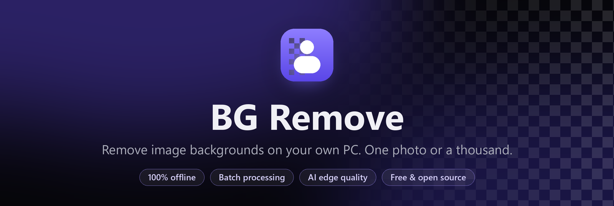
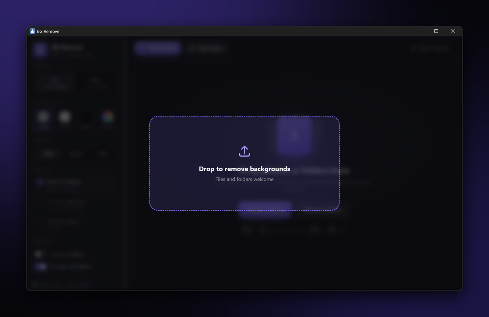
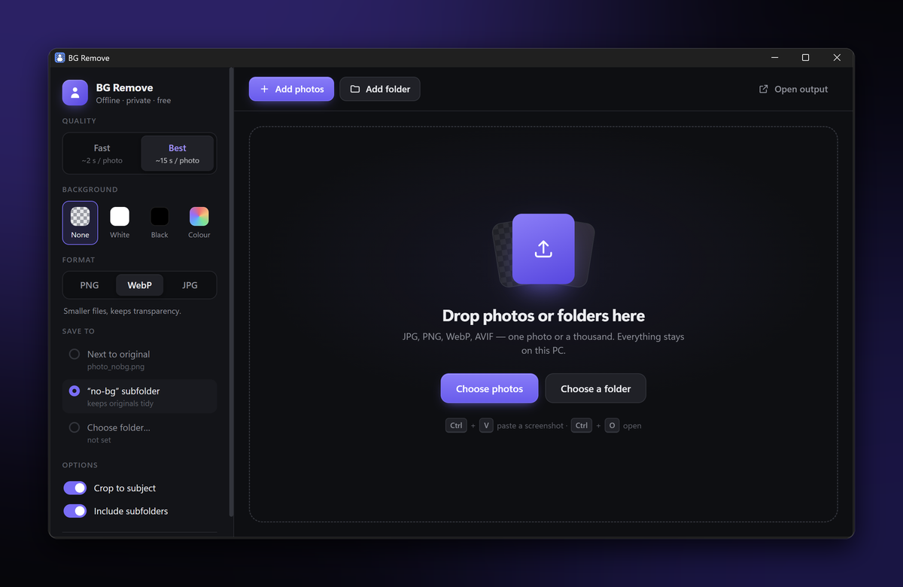
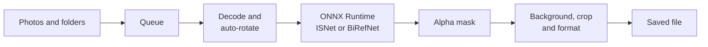

<div align="center">



<br>

[](https://github.com/abhirup780/remove-bg/releases/latest/download/BG-Remove-Setup-1.0.0.exe)

[](https://github.com/abhirup780/remove-bg/releases/latest)
[](#system-requirements)
[](LICENSE)

**Drop in a photo — or a folder of a thousand — and get clean, transparent cut-outs in seconds.**<br>
No uploads, no accounts, no watermarks. Everything runs on your machine.

</div>

<br>

<p align="center">
  
</p>

## Highlights

<table>
<tr>
<td width="50%" valign="top">

**🔒 Completely private**<br>
Images never leave your PC. The AI models ship inside the installer and work with no internet connection.

</td>
<td width="50%" valign="top">

**📦 Built for bulk**<br>
Drop entire folders (including subfolders). A live queue shows progress, time remaining, and lets you pause, stop or retry failures.

</td>
</tr>
<tr>
<td valign="top">

**✨ Two quality modes**<br>
**Fast** for everyday photos in about two seconds, **Best** for hair, glass and fine edges with a state-of-the-art model.

</td>
<td valign="top">

**🎨 Ready-to-use output**<br>
Transparent PNG or WebP, or a white, black or custom-colour background as JPG. Optional crop to the subject.

</td>
</tr>
<tr>
<td valign="top">

**🖼️ Every common format**<br>
JPG, PNG, WebP, AVIF, BMP and TIFF in, with phone-camera rotation handled automatically.

</td>
<td valign="top">

**🔍 Before / after viewer**<br>
Click any result to compare it with the original using a slider, preview it on different backgrounds and redo it in one click.

</td>
</tr>
</table>

## Download

1. Download **[BG-Remove-Setup-1.0.0.exe](https://github.com/abhirup780/remove-bg/releases/latest/download/BG-Remove-Setup-1.0.0.exe)** from the [latest release](https://github.com/abhirup780/remove-bg/releases/latest).
2. Run it. No administrator rights are needed; it installs for your user account and adds Start Menu and Desktop shortcuts.
3. Open **BG Remove** and drop in your photos.

> [!NOTE]
> The installer is not code-signed yet, so Windows SmartScreen may show *"Windows protected your PC"*.
> Click **More info → Run anyway**. You can verify the download against the SHA-256 checksum on the release page.

## How to use

<table>
<tr>
<td width="50%"></td>
<td width="50%"></td>
</tr>
<tr>
<td align="center"><sub>Drag photos or folders anywhere onto the window</sub></td>
<td align="center"><sub>Choose quality, background, format and destination</sub></td>
</tr>
</table>

| Action | How |
| --- | --- |
| Add photos | Drag and drop, **Add photos**, or <kbd>Ctrl</kbd> + <kbd>O</kbd> |
| Add a whole folder | Drag the folder in, or **Add folder** |
| Paste a screenshot | <kbd>Ctrl</kbd> + <kbd>V</kbd> |
| Compare before / after | Click any finished photo, then drag the slider |
| Browse results | <kbd>←</kbd> <kbd>→</kbd> in the viewer, <kbd>Esc</kbd> to close |
| Open files from Explorer | Drag files onto the desktop icon |

Processing starts as soon as photos are added. Results are saved next to the originals as `photo_nobg.png` by default,
or in a `no-bg` subfolder, or in a folder you choose. Existing files are never overwritten.

## Quality modes

| Mode | Model | Speed* | Best for |
| --- | --- | --- | --- |
| **Fast** | [ISNet](https://github.com/xuebinqin/DIS) (DIS, general use) | ~2 s / photo | People, products, everyday photos |
| **Best** | [BiRefNet](https://github.com/ZhengPeng7/BiRefNet) (lite) | ~15–25 s / photo | Hair, fur, transparent objects, cluttered scenes |

<sub>*Measured on a Ryzen 5 7530U laptop CPU with 4–24 MP photos. No GPU required.</sub>

**Tip for large batches:** run everything in **Fast**, then open the few results that need more care,
switch to **Best**, and click **Redo with current settings**.

## System requirements

- Windows 10 or 11, 64-bit
- About 500 MB of free disk space
- Any modern CPU; no graphics card needed
- Microsoft Edge WebView2 runtime (built into Windows 11; installed automatically on Windows 10 if missing)

## How it works



Two worker threads overlap image decoding and saving with model inference, which runs one image at a time
on all CPU cores. The interface is HTML and CSS rendered in a native window through WebView2.

## Build from source

```powershell
git clone https://github.com/abhirup780/remove-bg.git
cd remove-bg
py -3.13 -m venv .venv
.venv\Scripts\python -m pip install -r requirements.txt pyinstaller
```

Place the two models in `models/` as `isnet-general-use.onnx` and `birefnet-general-lite.onnx`.
They are the [rembg](https://github.com/danielgatis/rembg) models of the same names: one way to fetch them is
`pip install rembg`, then call `rembg.new_session("isnet-general-use")` and `new_session("birefnet-general-lite")`
and copy the files from `~/.rembg/models/`.

```powershell
.venv\Scripts\pythonw app.py                          # run from source
powershell -ExecutionPolicy Bypass -File build.ps1    # build the installer
```

`build.ps1` uses [PyInstaller](https://pyinstaller.org) and [Inno Setup 6](https://jrsoftware.org/isinfo.php), and expects
Microsoft's WebView2 bootstrapper at `redist/MicrosoftEdgeWebview2Setup.exe`
([download](https://go.microsoft.com/fwlink/p/?LinkId=2124703)). The result is `installer/BG-Remove-Setup-<version>.exe`.

<details>
<summary><b>Project structure</b></summary>

```text
app.py              Application: queue, workers, file handling, window
segment.py          Minimal ONNX Runtime segmentation engine
ui/                 Interface (HTML, CSS, JavaScript)
bgremove.spec       PyInstaller build definition
installer.iss       Inno Setup installer script
build.ps1           One-command build
docs/               README images
```

</details>

## Acknowledgements

BG Remove stands on the shoulders of excellent open-source work:

- [ISNet / DIS](https://github.com/xuebinqin/DIS) by Xuebin Qin et al. (Apache-2.0)
- [BiRefNet](https://github.com/ZhengPeng7/BiRefNet) by Peng Zheng et al. (MIT)
- [rembg](https://github.com/danielgatis/rembg) by Daniel Gatis, for the ONNX model exports (MIT)
- [ONNX Runtime](https://onnxruntime.ai), [pywebview](https://pywebview.flowrl.com) and [Pillow](https://python-pillow.org)

## License

Released under the [MIT License](LICENSE). The bundled models remain under their respective licenses.
